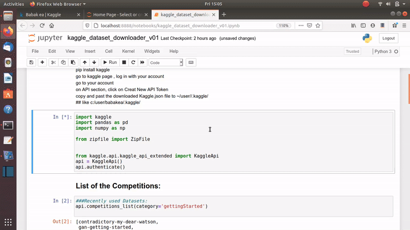

# Kaggle_dataset_downloader
Kaggle Dataset Downloader 

How to download a dataset from Kaggle using Kaggle API

To start working with the Kaggle API you need 

1) install the Kaggle API using 

pip install kaggle 

2) create a Kaggle token and download it from your Kaggle page

3) copy and paste the downloaded Kaggle token (Kaggle.json) on your user path (~/user//.kaggle/)

## like c:/user/babakea/.kaggle/

import the Kaggle API 

api.competitions_list(category='gettingStarted')

  
